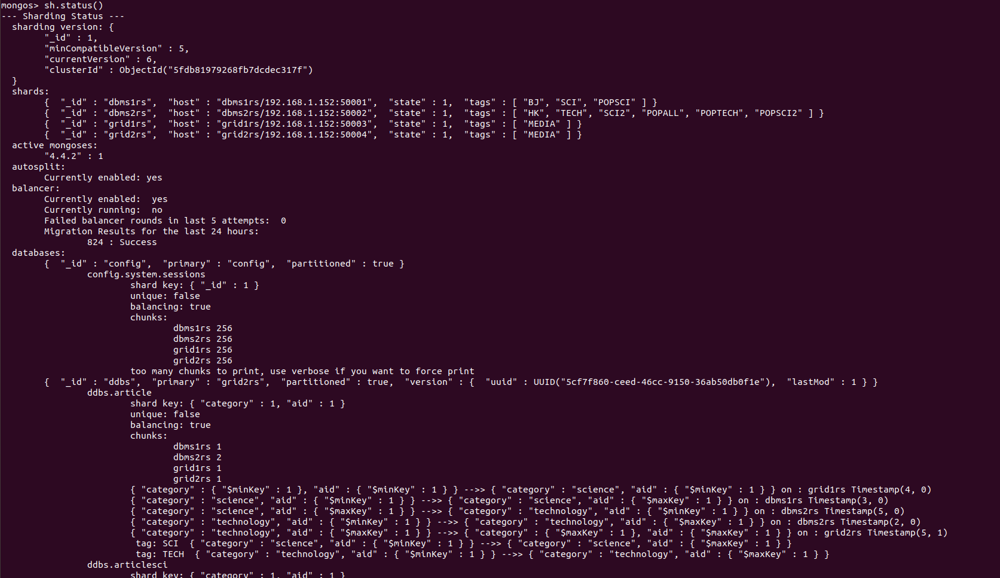
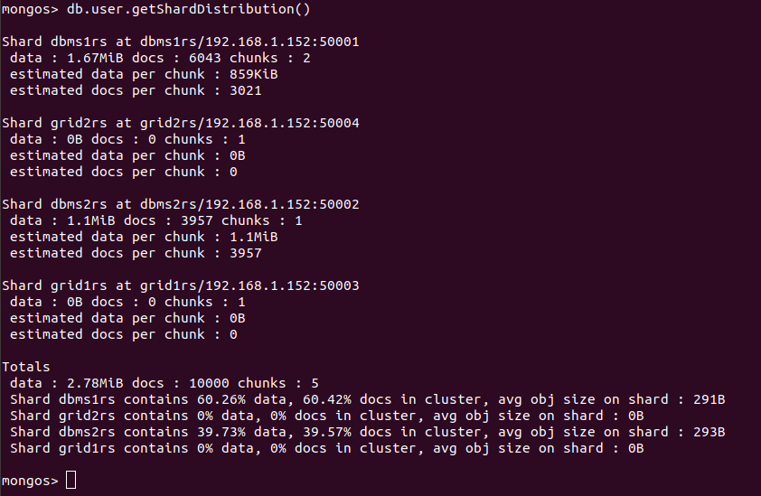

# Full tutorial on project set-up and working in mongo shell

## Generating 10GB of dummy data to work on
Run the sharding/proj_data/genTable_mongoDB10G.py script to generate the three structured data files: user.dat, article.dat, read.dat, and the unstructured multimedia data which are stored in the sharding/proj_data/articles directory.

## Setting up docker containers to simulate different machines for data distribution (sharding)

We set up 8 docker containers in total: 3 config servers in a replica set, 1 mongos server which is the router and acts like the data centre that coordinates all collections, 2 DBMS server shards for distributing structured data and 2 GridFS server shards for distributing multimedia data. MongoDB supports replica sets which should contain at least a cluster of three servers: one primary and two secondary, but due to lack of computer space, we decided to just have single servers instead of replica sets of DBMS and GridFS shards. The configuration of each docker container are specified the docker-compose.yaml files. The detailed instructions of setting up the docker containers for sharding can be found in [00-setup-sharding-doc.md](https://github.com/kwyoke/DDBS-2020/blob/main/sharding/00-setup-sharding-doc.md). This part is based on this  [YouTube tutorial series for MongoDB](https://www.youtube.com/watch?v=LBthwZDRR-c&list=PL34sAs7_26wPvZJqUJhjyNtm7UedWR8Ps).

## Loading, sharding and populating stuctured collections
The collections db.user, db.article, db.read are sharded according to requirements, and the derived collections db.beread, db.popRank are populated by aggregating the three raw collections. The detailed instructions for loading, sharding and populating these collections can be found in [01_load_shard_populate_doc.md](https://github.com/kwyoke/DDBS-2020/blob/main/sharding/01_load_shard_populate_doc.md).

## Auto refreshing of derived collections when changes are made to raw collections
When there are insertions or updates to db.user, db.article and db.read, the derived collections db.beread and db.popRank also updates. Using pymongo and MongoDB's changestream utilities, we are able to constantly watch for changes and react to them accordingly. Detailed instructions can be found in [02_auto_refresh.md](https://github.com/kwyoke/DDBS-2020/blob/main/sharding/02_auto_refresh.md).

## Loading and sharding multimedia data in GridFS
The multimedia data is quite large, and is loaded into GridFS servers with the mongofiles utility (used from command line). Detailed instructions can be found in [03_gridfs.md](https://github.com/kwyoke/DDBS-2020/blob/main/sharding/03_gridfs.md). The multimedia data can then be easily retrieved from GridFS using the mongofiles utility.

#### Monitoring of data distribution and server workload
Simply type in the mongos mongo shell "sh.status" to get an overall summary of each shard server, and db.article.getShardDistribution() to get the amount of documents distributed across different shards.

